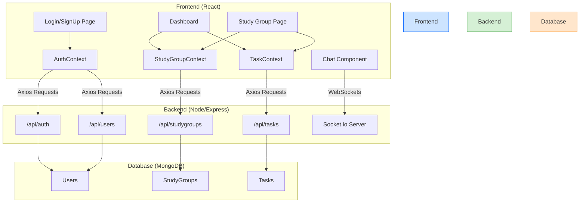

# Collaborative Study Planner

A full-stack, real-time study application designed to help students organize, collaborate, and communicate effectively. This platform provides a centralized hub for managing study groups, tracking tasks on a shared calendar, and chatting in real-time.

## Key Features

- **User Authentication:** Secure user registration and login using JWT (JSON Web Tokens).
- **Study Group Management:** Users can create new study groups, see a list of their groups, and view detailed group pages.
- **Real-time Chat:** Each study group has a dedicated chat room powered by Socket.io for instant communication.
- **Collaborative Task Calendar:** A shared, interactive calendar (`react-big-calendar`) where group members can create, view, and manage tasks.
- **Modern UI/UX:** A beautiful, responsive user interface with a "glassmorphism" design for a clean and modern aesthetic.
- **MERN Stack:** Built with a robust and popular technology stack for modern web development.

## System Design & Architecture

The application is built on the MERN stack, leveraging a React frontend, a Node.js/Express backend, and a MongoDB database for data persistence. Real-time communication is handled by Socket.io.



## Technology Stack

- **Frontend:**
  - React.js
  - React Router
  - Material-UI
  - Axios
  - Socket.io Client
  - React Big Calendar
  - Vite
- **Backend:**
  - Node.js
  - Express.js
  - MongoDB with Mongoose
  - Socket.io
  - JSON Web Token (JWT)
  - Bcrypt.js
  - Cors & Dotenv

## API Endpoints

| Method | Endpoint                | Description                       | Protected |
|--------|-------------------------|-----------------------------------|-----------|
| POST   | `/api/users/register`   | Register a new user               | No        |
| POST   | `/api/auth/login`       | Log a user in                     | No        |
| GET    | `/api/auth/user`        | Get the logged-in user's data     | Yes       |
| GET    | `/api/studygroups`      | Get all study groups for a user   | Yes       |
| POST   | `/api/studygroups`      | Create a new study group          | Yes       |
| GET    | `/api/studygroups/:id`  | Get details of a single group     | Yes       |
| POST   | `/api/studygroups/:id/members` | Add a member to a group    | Yes       |
| GET    | `/api/tasks/:groupId`   | Get all tasks for a study group   | Yes       |
| POST   | `/api/tasks`            | Create a new task                 | Yes       |
| PUT    | `/api/tasks/:id`        | Update a task (e.g., due date)    | Yes       |
| DELETE | `/api/tasks/:id`        | Delete a task                     | Yes       |


## Getting Started

Follow these instructions to get a copy of the project up and running on your local machine.

### Prerequisites

- Node.js (v14 or later)
- npm
- MongoDB (A local installation or a cloud instance from [MongoDB Atlas](https://www.mongodb.com/cloud/atlas))

### Backend Setup

1.  **Clone the repository:**
    ```bash
    git clone https://your-repository-url/
    cd MultiplayerRoom/backend
    ```
2.  **Install dependencies:**
    ```bash
    npm install
    ```
3.  **Create a `.env` file** in the `backend` directory with the following variables:
    ```env
    MONGO_URI=your_mongodb_connection_string
    JWT_SECRET=your_jwt_secret
    ```
4.  **Start the server:**
    ```bash
    npm start
    ```
    The backend server will be running on `http://localhost:5000`.

### Frontend Setup

1.  **Navigate to the frontend directory** in a new terminal:
    ```bash
    cd MultiplayerRoom/frontend
    ```
2.  **Install dependencies:**
    ```bash
    npm install
    ```
3.  **Start the development server:**
    ```bash
    npm run dev
    ```
    The frontend application will be available at `http://localhost:5173` (or another port if 5173 is busy).

## Screenshots

*(Placeholder for Login Page Screenshot)*


*(Placeholder for Dashboard Screenshot)*


*(Placeholder for Study Group Page Screenshot)*
 